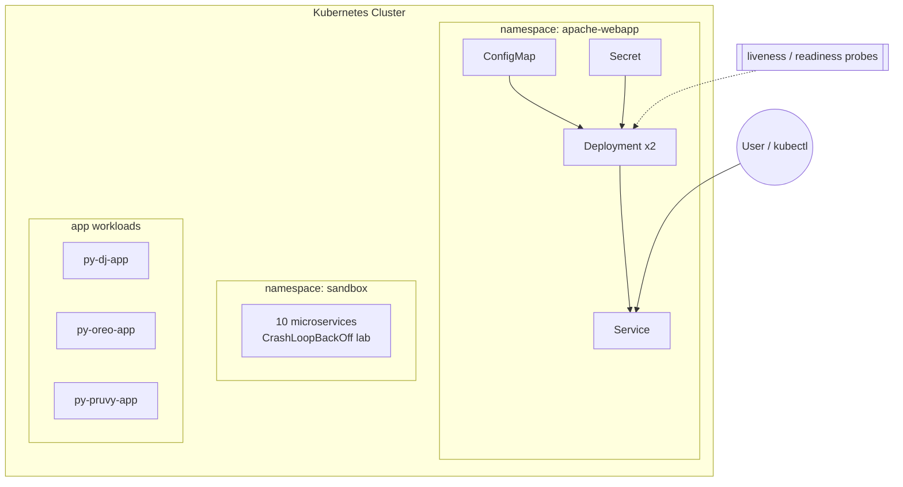

# k8s-platform-labs 🚢

> Production-style Kubernetes manifests and a hands-on **CrashLoopBackOff debugging sandbox** — the day-to-day toolkit of a Platform / SRE engineer.

<p>
  
  
  
  
  
</p>

---

## Overview

This repo is a working lab of **56+ Kubernetes manifests** covering the patterns you actually use in production: multi-replica Deployments, Services, ConfigMaps, Secrets, liveness/readiness probes, and resource requests/limits — plus custom Docker images for Apache, Debian, and Ubuntu web apps.

It also includes a deliberate **failure sandbox**: 10 microservices engineered to `CrashLoopBackOff` so you can practice real incident diagnosis (`kubectl describe`, `logs`, `events`, exit codes).

## Architecture



## What's inside

| Path | Purpose |
|------|---------|
| `apache-webapp/`, `coral-webapp/`, `kaki-app/` | Full app bundles — Deployment + Service + ConfigMap + Secret with probes & resource limits |
| `manifests/sandbox/crashloop/` | **10 microservices** (payment, auth, billing, inventory…) that intentionally crash — a debugging playground |
| `Docker/`, `debian/`, `ubuntu-webapp/` | Custom container images (Apache/httpd on Ubuntu & Debian) |
| `py-dj-app/`, `py-oreo-app/`, `py-pruvy-app/` | Deployment/Service manifests for the companion app repos |
| `manifests/` | Assorted demo apps (httpd, first-webapp, demo-app) |

## Quickstart

```bash
# 1. Point kubectl at a cluster (minikube, kind, or a real one)
kubectl cluster-info

# 2. Deploy the Apache web app (namespace, config, secret, deployment, service)
kubectl create namespace apache-webapp
kubectl apply -f apache-webapp/

# 3. Watch it come up
kubectl get pods -n apache-webapp -w

# 4. Reach the service
kubectl port-forward -n apache-webapp svc/apache-webapp 8080:80
# open http://localhost:8080
```

### Run the CrashLoopBackOff lab 🔥

```bash
kubectl apply -f manifests/sandbox/namespace.yaml
kubectl apply -f manifests/sandbox/crashloop/

# Now practice the incident:
kubectl get pods -n sandbox                      # see the crashing pods
kubectl describe pod <pod> -n sandbox            # events + last state
kubectl logs <pod> -n sandbox --previous         # the crash output
```

## What this demonstrates

- **Core Kubernetes objects** — Deployments, Services, ConfigMaps, Secrets, Namespaces.
- **Reliability patterns** — liveness & readiness probes, `resources.requests/limits`, replica management.
- **Config/secret separation** — 12-factor style env injection via `configMapKeyRef` / `secretKeyRef`.
- **Container image building** — multi-distro Dockerfiles serving static content.
- **Incident response** — a repeatable CrashLoopBackOff debugging drill.

## Roadmap

- [ ] CI: `kubeconform` / `kubeval` manifest validation on every push
- [ ] `kustomize` base + `dev`/`prod` overlays
- [ ] Helm chart for the apache-webapp bundle
- [ ] A short terminal GIF of the deploy-then-debug flow

## License

MIT — see [LICENSE](LICENSE).
